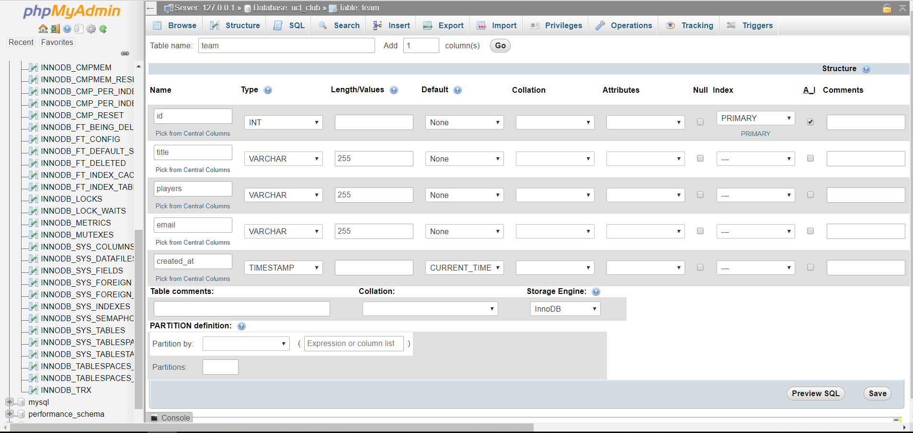
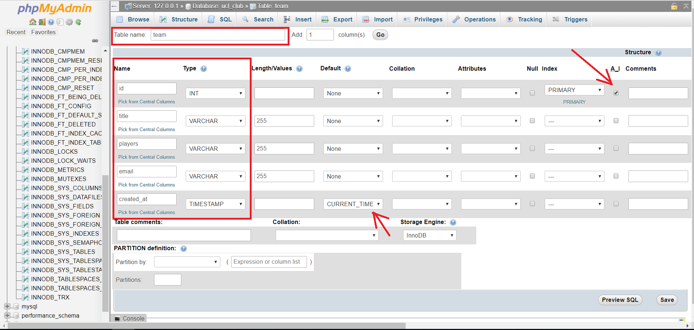
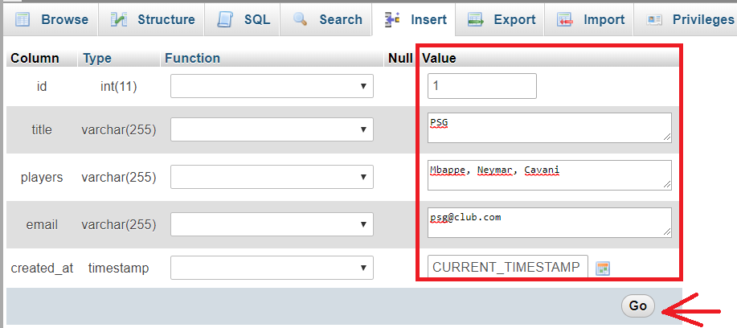

[youtube tutorials](https://www.youtube.com/watch?v=nWeW3sCmD2k&t=52s)

### creating database 
```CREATE DATABASE dbName;```

### deleting database 
```DROP DATABASE dbName;```

### creating table 
 - go to database
```
CREATE TABLE customers(
    id INT NOT NULL AUTO_INCREMENT, 
    firstName VARCHAR(255),
    lastName VARCHAR(255),
    email VARCHAR(255), 
    address VARCHAR(255),
    city VARCHAR(255),
    state VARCHAR(255),
    zipcode VARCHAR(255),
    PRIMARY KEY(id)
);
```


### Table
 - insert info into
```
INSERT INTO customers(firstName, lastName, email, address, city, state, zipcode) VALUES 
('Leonel', 'Messi', 'messi@gmail.com', 'Dhanmondi','Dhaka', 'Dhaka', '1209');
```


 - insert multiple 
```
INSERT INTO customers(firstName, lastName, email, address, city, state, zipcode) VALUES 
('Neymar', 'Jr', 'neymar@gmail.com', 'Sau Paolo','Saupaolo', 'Brazil', '1345'),
('Kylion', 'Mbappe', 'kylion@gmail.com', 'Paris sg','Paris', 'France', '1568'),
('Antone', 'Grizmann', 'antone@gmail.com', 'Atlitico madrid','Paris', 'France', '1209'),
('Cristiano', 'Ronaldo', 'cr7@gmail.com', 'juventus','Turin', 'Portugal', '1456'),
('Philipe', 'Coutinho', 'coutinho@gmail.com', 'Barcelona','Sau Paolo', 'Brazil', '1204');
```


### updating records
```UPDATE customers SET email = 'cr7@juv.com' WHERE id=5; ```


### deleting customer
```DELETE FROM customers WHERE id = 6;```

### adding table column
```ALTER TABLE customers ADD testCol VARCHAR(255);```

### changing data types for column
``` ALTER TABLE customers MODIFY COLUMN testCol INT(11);```

``` ALTER TABLE customers DROP COLUMN testCol; ```

### deleting column
``` ALTER TABLE customers DROP COLUMN testCol; ``` 

### selecting all
``` SELECT * FROM customers;    ``` 
###  limited selection
``` SELECT firstName, lastName FROM customers;  ``` 
### selecting specific customer
``` SELECT * FROM customers WHERE id = 2;   ``` 
### by last name from customer
``` SELECT * FROM customers ORDER BY lastName;  ``` 
### last name from customer descending
``` SELECT * FROM customers ORDER BY lastName DESC; ``` 
### last name from customer ascending but ascending is default
``` SELECT * FROM customers ORDER BY lastName DESC; ``` 
###  getting all state
``` SELECT state FROM customers;    ``` 
###  getting all state without duplicate
``` SELECT DISTINCT state FROM customers;   ``` 

### operator
```SELECT * FROM `customers` WHERE age < 29;```
```SELECT * FROM `customers` WHERE age BETWEEN 26 AND 29;```
### city of customers ends with n
```SELECT * FROM customers WHERE city LIKE '%n';```
### city of customers ends with on
```SELECT * FROM customers WHERE city LIKE '%on';```
### any city that has a in it
```SELECT * FROM customers WHERE city LIKE '%a%';```
### any city that has no a in it
```SELECT * FROM customers WHERE city NOT LIKE '%a%';```


# Creating db with GUI





 1. From **PHPMyAdmin** -> database -> create database -> dbname -> create
 2. make a table name -> click on table
 3. From the screenshots above -> Name -> property name
 4. type is the type of property that is 
 5. setting cerrent time
 6. A_I Comments -> for auto increments id when update

 ### adding data to db
 7. **PhpMyAdmin** -> databases -> db_name -> table_name
 8. structure (optional, to see the table) -> insert
 
 

 9. setting value this way -> go
 10. Browse tab to show the records