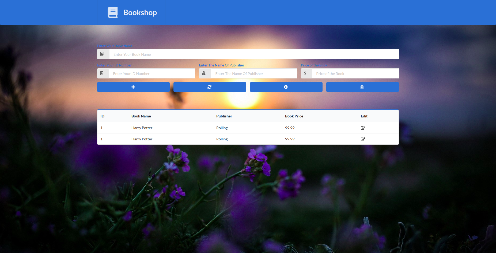

# Learning PHP

# XSS Attacks

Cross-Site Scripting (XSS) attacks are a type of injection, in which malicious scripts are injected into otherwise benign and trusted websites.

## Getting data from db

There are three step 
 1. construct the query
 2. make the query
 3. fetch the query

## Explode function 

[Function referance](https://www.php.net/manual/en/function.explode.php)

[MYSQLI](https://www.php.net/manual/en/book.mysqli.php)

# PHP BookShop CRUD

[*tutorial link*](https://www.youtube.com/watch?v=JZdMXUIMdQw)

using 
 1. php
 2. Semantic UI
 3. Javascript
 4. css 
