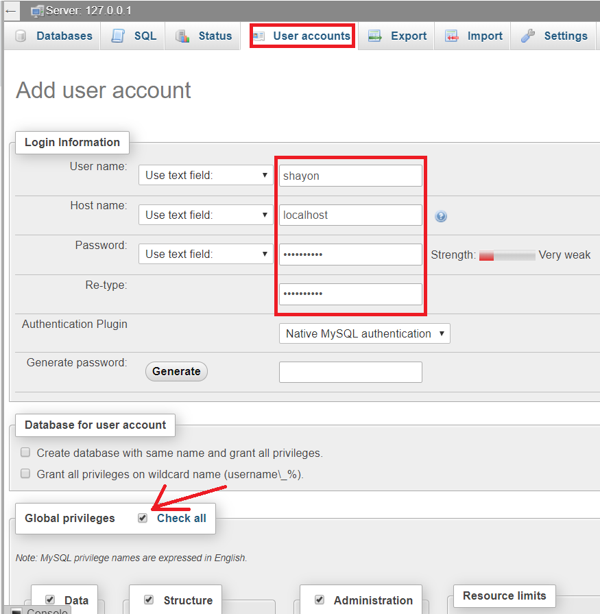

# Learning PHP

# XSS Attacks

Cross-Site Scripting (XSS) attacks are a type of injection, in which malicious scripts are injected into otherwise benign and trusted websites.

## Getting data from db

There are three step 
 1. construct the query
 2. make the query
 3. fetch the query
 
 ### Connect to DB
 
 - User setting
 
 
 
 - Create table and column
 
 